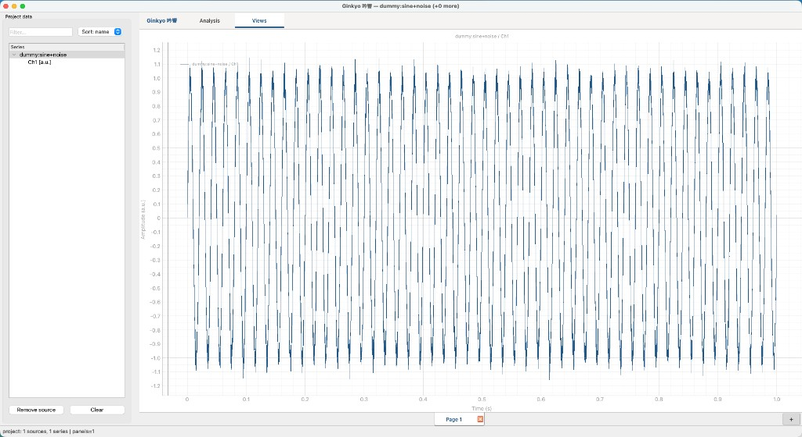
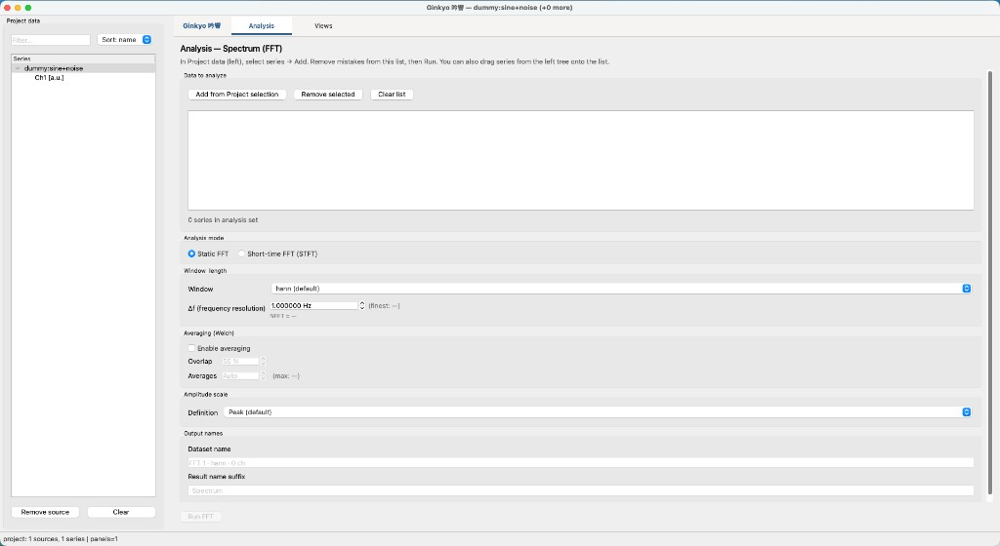

# 吟響 / Ginkyo（ぎんきょう）

音を吟味する、振動・音データの解析ワークベンチ。

## Status

**v0.1.0** — ファイルを開く・見る・FFT/STFT・スペクトル計測・プロジェクト保存まで一通り使えるプレビュー版。

日常利用は **GitHub Releases の実行ファイル**（Windows / macOS）を想定。ソースは同じリポジトリで公開（MIT）。

## Screenshots





## Download（使う人向け）

1. [Releases](https://github.com/learningnauts/ginkyo/releases) から最新の zip を取得  
   - `ginkyo-windows-x64.zip`  
   - `ginkyo-macos-arm64.zip`（Apple Silicon 向け。Intel Mac はソースから実行）
2. 展開して `ginkyo`（Windows は `ginkyo.exe`）を起動  
3. 初回は OS の警告が出ます。対処は次の「初回起動時の警告について」を参照

タグ `v*` を push すると GitHub Actions が両 OS のバイナリを自動ビルドして Release に添付します。手順は [RELEASE.md](RELEASE.md)。

### 初回起動時の警告について

配布バイナリはコード署名をしていないため、初回だけ OS のセキュリティ警告が出ます。アプリの不具合ではありません。

**Windows** — 「WindowsによってPCが保護されました」（SmartScreen）が出た場合:

1. **詳細情報** をクリック
2. **実行** をクリック

一度実行すれば、次回からは表示されません。ウイルス対策ソフトが誤検知する場合は、展開先フォルダを許可（除外）してください。

**macOS** — 「"ginkyo" にマルウェアが含まれていないことを検証できませんでした」と出て開けない場合:

1. 一度開こうとして警告を出す（閉じてよい）
2. **システム設定 → プライバシーとセキュリティ** を開く
3. 下の方にある「"ginkyo" はブロックされました…」の **このまま開く** をクリック
4. もう一度アプリを開く

ターミナルが使える場合は、検疫属性を外す方法でも起動できます:

```bash
xattr -dr com.apple.quarantine /path/to/ginkyo.app
```

いずれも初回のみで、2回目以降は普通に起動します。

## Requirements（ソースから動かす場合）

- Python 3.9+
- macOS / Windows / Linux（デスクトップ GUI）

## Quick start（開発者）

```bash
cd /path/to/ginkyo
python3 -m venv .venv
source .venv/bin/activate   # Windows: .venv\Scripts\activate
pip install --no-compile -e .
python -m ginkyo
```

> Tip: full `PySide6` のインストールで失敗する場合は `PySide6-Essentials`（本プロジェクト既定）と `pip install --no-compile` を試してください。

### In the app

- **File → Open / Save project…** — `.ginkyo`（波形埋め込み・ビュー復元）
- **File → Add file…** — `.wav` / `.csv` / `.uff` / `.unv`
- **Analyze / Analysis** — FFT スペクトル、STFT スペクトログラム（Overlap / Δt / equal angle / equal RPM）
- **Views** — ページ・レイアウト・DnD で Mag+Phase / スペクトログラム表示
- **View → Spectrum measure** — Mag Linear/dB、Overall / Band RMS、ピーク拾い
- **View → Cursor values** — マウス／縦マーカーの値表

### From Python (read-only)

```python
from ginkyo import Project

proj = Project.open("Run.ginkyo")
for sid in proj.series_order:
    s = proj.get(sid)
    print(s.name, s.meta.point_id, s.meta.dof)
    y = s.data  # loads on first access
```

### Samples

| File | Notes |
|------|--------|
| `samples/demo_sine_stereo.wav` | stereo sine |
| `samples/demo_sine_stereo.csv` | same as CSV (`Name [unit]` headers) |
| `samples/demo_time.uff` | 2-ch dataset-58 time |
| `samples/demo_10ch_time.uff` | 10-ch dataset-58 time |
| `samples/demo_tacho_pulse.csv` | vibration + pulse tacho (run-up) |
| `samples/demo_tacho_rpm.csv` | vibration + RPM run-up |

Equal-RPM STFT: add a tacho sample → Analysis → STFT → **Equal RPM** → pick pulse or RPM series → Views → **Y axis → RPM**.

### Build desktop binary locally

```bash
pip install -e . pyinstaller
pyinstaller packaging/ginkyo.spec --noconfirm
# → dist/ginkyo/
```

## Known limitations

- dB は `20·log10`、基準は系列単位の **1**（SPL や ISO 振動基準は未対応）
- バンド RMS は Analysis の **peak / rms** 振幅定義を推奨（`lin` は厳密な工学 RMS ではない）
- Release バイナリは未署名
- ライブ取得・プラグイン・オーダー解析は未収録（今後の拡張）

## License

MIT — see [LICENSE](LICENSE).

## Notes

Product vision and private milestones live in a personal workspace memo (not in this repo). See [CHANGELOG.md](CHANGELOG.md) for release history.
